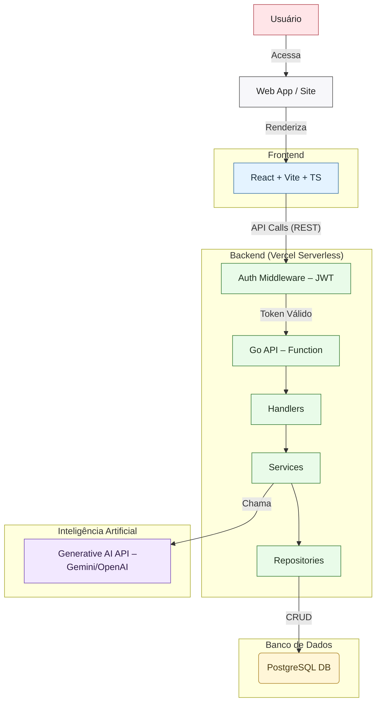

### Diagrama de Arquitetura

### Explicação das Escolhas Técnicas

1.  **Front-end**:
    *   **Tecnologia**: **React com Vite, TypeScript e Tailwind CSS**.
    *   **Justificativa**: A estrutura `frontend/` com arquivos `.tsx`, `vite.config.ts`, e `tailwind.config.ts` indica claramente essa stack. É uma escolha moderna que oferece desenvolvimento rápido (Vite), segurança de tipos (TypeScript) e estilização eficiente e customizável (Tailwind CSS).

2.  **Plataforma**:
    *   **Tipo**: **Aplicação Web Customizada**.
    *   **Justificativa**: O projeto não utiliza uma plataforma de bots pré-pronta como Dialogflow. Em vez disso, é uma aplicação web completa onde o frontend consome uma API backend, oferecendo controle total sobre a experiência do usuário.

3.  **Backend**:
    *   **Tecnologia**: **Go (Golang)**.
    *   **Justificativa**: A presença de `go.mod` e `main.go` no diretório `backend/` confirma o uso de Go. Go é conhecido por sua alta performance, concorrência nativa e eficiência, sendo uma excelente escolha para construir APIs rápidas e escaláveis. A arquitetura segue um padrão em camadas (handlers, services, repositories) para organização e manutenibilidade.

4.  **Integração AI/NLP API**:
    *   **Tecnologia**: **API de IA Generativa (Ex: Gemini, OpenAI)**.
    *   **Justificativa**: O propósito do sistema é "geração de briefing". Isso é alcançado através de uma chamada de API do backend (Go) para um serviço externo de Large Language Model (LLM). O backend envia o prompt do usuário e recebe o texto do briefing gerado.

5.  **APIs usadas**:
    *   **API Interna**: Uma **REST API** criada em Go, que serve como ponte entre o frontend e a lógica de negócio/banco de dados.
    *   **API Externa**: A API da plataforma de **IA Generativa** para criar os briefings.

6.  **Bot Flow (Fluxo do Usuário na Aplicação)**:
    *   **Autenticação**: O usuário se cadastra ou faz login. O backend valida as credenciais e retorna um **JWT (JSON Web Token)**.
    *   **Requisições Autenticadas**: O frontend armazena o JWT e o envia no cabeçalho de cada requisição para rotas protegidas. O `Auth Middleware` no backend valida esse token.
    *   **Geração de Briefing**: O usuário preenche um formulário no frontend. Os dados são enviados para a API Go, que os processa e faz a chamada para a API de IA. O resultado é retornado e exibido ao usuário.

7.  **Autenticação e Controle de Acesso**:
    *   **Tecnologia**: **JWT (JSON Web Tokens)**.
    *   **Justificativa**: Os diretórios `auth/` e `security/` no backend sugerem um sistema de autenticação customizado. JWT é um padrão de mercado, ideal para APIs stateless, permitindo que o frontend faça requisições autenticadas sem que o servidor precise armazenar dados de sessão.

8.  **Intenções, Entidades e Base de Conhecimento (Adaptação para Web App)**:
    *   **Intenções**: Correspondem às **Ações do Usuário**, como `fazerLogin`, `criarBriefing`, `verHistorico`.
    *   **Entidades**: São os **Modelos de Dados** do sistema, definidos em `models/`, como `User` e `Briefing`.
    *   **Base de Conhecimento**: É o **Banco de Dados PostgreSQL** (inferido pelo arquivo `.psql`), que armazena os dados dos usuários e briefings gerados, combinado com o conhecimento do modelo da **API de IA Generativa**.

9.  **Hospedagem / Servidor**:
    *   **Plataforma**: **Vercel**.
    *   **Justificativa**: A presença de arquivos `vercel.json` tanto no frontend quanto no backend indica que o projeto está configurado para deploy na Vercel. A Vercel é ideal para essa stack, hospedando o frontend React de forma otimizada e executando o backend Go como Funções Serverless, o que garante escalabilidade e custo-benefício.

10. **Canal de Publicação**:
    *   **Canal**: **Website**.
    *   **Justificativa**: O produto final é uma aplicação web acessível por qualquer navegador, servindo como o canal principal de interação com o usuário.