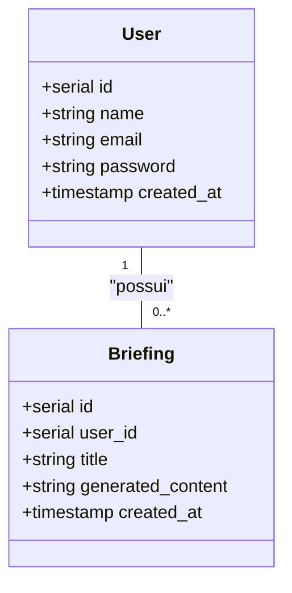

# Análise do Backend e Normalização UML

Este documento apresenta uma análise da arquitetura do backend do "Briefing Generation System", uma visão geral do modelo de dados com um diagrama de classes UML e uma análise da normalização do banco de dados.

## 1. Arquitetura do Backend

O backend é desenvolvido em Go e segue uma arquitetura em camadas (layered architecture), que promove a separação de responsabilidades e a manutenibilidade do código. As camadas são:

- **Handlers (Manipuladores):** Responsáveis por receber as requisições HTTP, validar os dados de entrada e orquestrar as chamadas para a camada de serviço. Eles atuam como a porta de entrada da API.
  - *Exemplos:* `CreateUser`, `LoginUser`, `GetBriefing`.

- **Services (Serviços):** Contêm a lógica de negócio principal da aplicação. Eles coordenam as operações, processam os dados e interagem com a camada de repositório.
  - *Exemplos:* `CreateUser` (que inclui a lógica de hash de senha), `SaveBriefing`.

- **Repositories (Repositórios):** Camada de acesso a dados. É a única parte do sistema que interage diretamente com o banco de dados, abstraindo as consultas SQL do resto da aplicação.
  - *Exemplos:* `GetUserByEmail`, `SaveUserBriefing`.

- **Models (Modelos):** Definem as estruturas de dados da aplicação, representando as entidades do sistema, como `User` e `Briefing`.

Essa arquitetura torna o sistema mais robusto, testável e fácil de evoluir.

## 2. Modelo de Dados e Diagrama de Classes UML

O sistema opera com duas entidades principais: `User` (Usuário) e `Briefing`.

- **User:** Representa um usuário do sistema, com informações como nome, email e senha.
- **Briefing:** Representa um briefing gerado, contendo o título, o conteúdo e a associação com o usuário que o criou.

Abaixo está um diagrama de classes UML que ilustra esses modelos e seu relacionamento.

O diagrama mostra que um `User` pode possuir zero ou muitos `Briefing`s, estabelecendo um relacionamento de um-para-muitos.

## 3. Análise da Normalização do Banco de Dados

O esquema do banco de dados, definido em `db_model.sql`, está em conformidade com a **Terceira Forma Normal (3NF)**.

- **Primeira Forma Normal (1NF):** Todos os atributos das tabelas são atômicos (indivisíveis) e cada registro é único, identificado por uma chave primária (`id`).
- **Segunda Forma Normal (2NF):** O esquema atende à 1NF e não possui dependências parciais. Como as tabelas usam uma chave primária simples (`id`), não há como ter dependências parciais, então a 2NF é atendida.
- **Terceira Forma Normal (3NF):** O esquema atende à 2NF e não possui dependências transitivas. Por exemplo, na tabela `briefings`, o `user_id` depende diretamente do `id` do briefing, e não há outro atributo não-chave que dependa de `user_id`. Todos os atributos dependem exclusivamente da chave primária.

A adesão à 3NF garante que o banco de dados seja eficiente, livre de anomalias de inserção, atualização e exclusão, e minimize a redundância de dados.