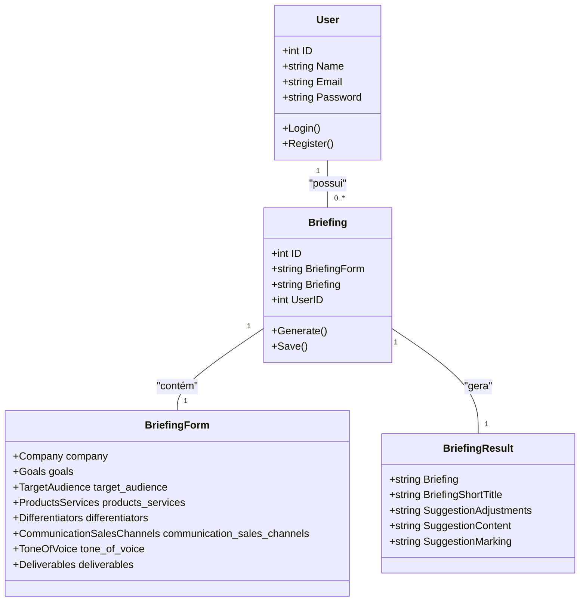

# Diagrama de Classes

## 1. O que é?

Um **Diagrama de Classes** é um tipo de diagrama da UML (Unified Modeling Language) que descreve a estrutura de um sistema, mostrando as classes do sistema, seus atributos, métodos e os relacionamentos entre os objetos.

Ele serve para:
- **Modelar a estrutura estática:** Visualizar como as diferentes partes do seu sistema estão conectadas.
- **Comunicar a arquitetura:** Facilitar a comunicação entre os membros da equipe sobre o design do software.
- **Servir como base para a implementação:** Guiar os desenvolvedores na escrita do código.

## 2. Diagrama do Sistema de Briefing

Abaixo está um diagrama de classes simplificado que representa as principais entidades do **Sistema de Geração de Briefing**. Ele foca nos modelos de dados e seus relacionamentos.

### Explicação das Entidades

-   **User:** Representa um usuário cadastrado no sistema. Ele possui um ID, nome, email e senha. É a entidade que "possui" os briefings.
-   **Briefing:** A entidade central que armazena o resultado do briefing gerado e o formulário que o originou. Cada briefing pertence a um único usuário (`UserID`).
-   **BriefingForm:** Representa o conjunto de dados que o usuário preenche para gerar um briefing. Contém informações detalhadas sobre a empresa, objetivos, público-alvo, etc.
-   **BriefingResult:** Armazena o conteúdo final gerado pelo sistema, incluindo o texto do briefing, um título e sugestões de marketing.

### Relacionamentos

-   **User `1` -- `0..*` Briefing:** Um usuário pode ter zero ou muitos briefings.
-   **Briefing `1` -- `1` BriefingForm:** Cada briefing é gerado a partir de um único formulário de briefing.
-   **Briefing `1` -- `1` BriefingResult:** Cada briefing resulta em um único conjunto de resultados.
