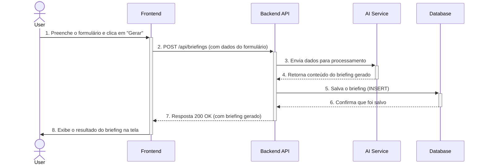

# Diagrama de Sequência

## 1. O que é?

O **Diagrama de Sequência** é um diagrama de interação da UML que mostra como os processos ou objetos operam uns com os outros e em que ordem. Ele é ótimo para visualizar a troca de mensagens entre os componentes de um sistema ao longo do tempo para realizar uma função específica.

Ele ajuda a entender:
- **Quem fala com quem:** Quais componentes interagem.
- **O que eles dizem:** Quais mensagens (chamadas de função, requisições HTTP) são trocadas.
- **Quando eles falam:** A ordem cronológica das interações.

## 2. Diagrama: Sequência de Geração de Briefing

Este diagrama ilustra a sequência de eventos que ocorrem quando um usuário solicita a geração de um novo briefing.

### Explicação da Sequência

1.  **Interação do Usuário:** O usuário preenche o formulário na interface do `Frontend` e inicia o processo.
2.  **Requisição HTTP:** O `Frontend` envia os dados do formulário para o `Backend API` através de uma requisição `POST`.
3.  **Processamento de IA:** O `Backend API` recebe a requisição e repassa os dados relevantes para um `AI Service` (Serviço de Inteligência Artificial), que é responsável por gerar o conteúdo do briefing.
4.  **Retorno da IA:** O `AI Service` retorna o texto do briefing gerado para o `Backend API`.
5.  **Persistência:** O `Backend API` envia o briefing gerado e os dados do formulário para o `Database` para serem armazenados.
6.  **Confirmação do DB:** O `Database` confirma que os dados foram salvos com sucesso.
7.  **Resposta para o Frontend:** O `Backend API` envia uma resposta de sucesso (`200 OK`) para o `Frontend`, contendo o briefing finalizado.
8.  **Exibição para o Usuário:** O `Frontend` recebe a resposta e exibe o resultado para o usuário.
