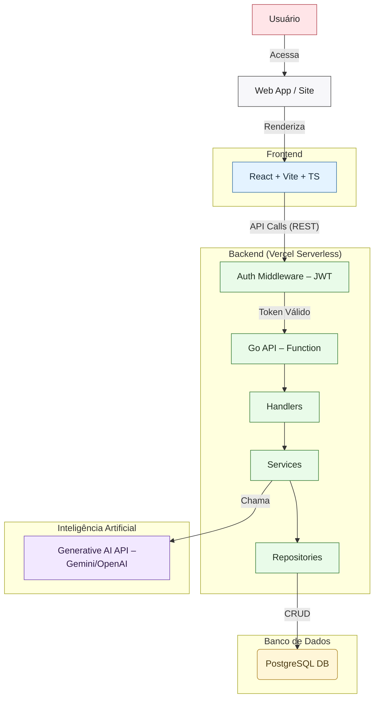

# Sprint 04 - Design Técnico do Projeto

Este documento detalha o design técnico do Sistema de Geração de Briefing, cobrindo a arquitetura da aplicação, armazenamento de dados, integrações e implantação.

## 4.1 Arquitetura da Aplicação

A arquitetura do sistema segue um modelo em camadas, desacoplando o front-end, o back-end e o banco de dados para garantir escalabilidade e manutenibilidade.

### Diagrama de Arquitetura



### Componentes e Tecnologias

*   **Front-end:** Desenvolvido com **React** e **TypeScript**, utilizando **Vite** como ferramenta de build. A interface é construída com a biblioteca de componentes **shadcn/ui** e estilizada com **Tailwind CSS**, garantindo uma experiência de usuário moderna e responsiva.
*   **Plataforma:** Aplicação web acessível através de navegadores modernos.
*   **Back-end:** Uma API **RESTful** desenvolvida em **Go (Golang)**. Utiliza o roteador `gorilla/mux` para gerenciar as rotas e middlewares. Foi escolhido pela sua performance, simplicidade e forte tipagem.
*   **Integração AI/NLP API:** A geração dos briefings é realizada através da integração com a **API do Gemini** (`gemini-2.5-flash-lite`) do Google. O back-end envia um prompt detalhado contendo as informações fornecidas pelo usuário e recebe um briefing estruturado em formato JSON.
*   **APIs Usadas:**
    *   **API Interna:** A API REST do próprio sistema, que expõe endpoints para autenticação, gerenciamento de usuários e operações de briefing.
    *   **Google Gemini API:** Utilizada para a funcionalidade principal de geração de conteúdo inteligente.
*   **Bot Flow:** Não aplicável. O sistema é uma aplicação web interativa e não um chatbot.
*   **Autenticação e Controle de Acesso:** A autenticação é baseada em **JWT (JSON Web Tokens)**. Após o login, um token é gerado e deve ser enviado no cabeçalho `Authorization` de cada requisição para as rotas protegidas da API. O back-end possui um middleware que valida o token antes de permitir o acesso.
*   **Intenções, Entidades e Base de Conhecimento:** Não aplicável no formato de chatbot. A "base de conhecimento" para a IA é fornecida dinamicamente através de um prompt detalhado que instrui o modelo Gemini sobre como estruturar o briefing.
*   **Hospedagem / Servidor:** Toda a aplicação (front-end, back-end e banco de dados) está hospedada na **Vercel**.
*   **Canal de Publicação:** A aplicação é publicada e acessível através de um **site**.

## 4.2 Armazenamento de Dados e Modelos

### Tipo de Banco de Dados e Motivo da Escolha

O sistema utiliza **PostgreSQL**, um banco de dados relacional (SQL). A escolha se justifica pela necessidade de manter a integridade referencial entre usuários e seus respectivos briefings, pela robustez e pela vasta gama de funcionalidades que o PostgreSQL oferece, como tipos de dados customizáveis e extensões (`pgcrypto`).

### Estratégia de Persistência de Dados

*   **Dados do Usuário:** Informações de cadastro (nome, email, senha criptografada) são armazenadas na tabela `users`.
*   **Briefings:** Os briefings gerados por cada usuário são salvos na tabela `briefings`, mantendo um relacionamento direto com a tabela `users`.
*   **Logs:** O back-end possui um middleware de logging para registrar as requisições recebidas. Em um ambiente de produção na Vercel, os logs das funções serverless são capturados e gerenciados pela própria plataforma.

### Segurança e LGPD

*   **Criptografia de Senha:** As senhas dos usuários são hasheadas utilizando o algoritmo **bcrypt** antes de serem persistidas no banco de dados. A verificação da senha no momento do login é feita comparando o hash da senha fornecida com o hash armazenado.
*   **Controle de Acesso:** O acesso aos dados do usuário é controlado por meio do middleware de autenticação JWT. Um usuário só pode acessar os briefings que ele mesmo criou.
*   **Consentimento do Usuário:** O processo de cadastro e o uso da plataforma implicam no consentimento para o armazenamento dos dados fornecidos e dos briefings gerados, o que deve ser explicitado nos Termos de Serviço da aplicação.

### Resumo da Estrutura das Tabelas

| Tabela    | Coluna            | Tipo          | Descrição                                         |
|-----------|-------------------|---------------|---------------------------------------------------|
| `users`   | `id`              | `UUID`        | Identificador único do usuário (Chave Primária)   |
|           | `name`            | `VARCHAR(255)`| Nome do usuário                                   |
|           | `email`           | `VARCHAR(255)`| Email do usuário (Único)                          |
|           | `password`        | `VARCHAR(255)`| Senha hasheada do usuário                         |
|           | `created_at`      | `TIMESTAMPTZ` | Data e hora de criação do registro                |
| `briefings`| `id`              | `UUID`        | Identificador único do briefing (Chave Primária)  |
|           | `user_id`         | `UUID`        | Chave estrangeira referenciando `users.id`        |
|           | `title`           | `VARCHAR(255)`| Título do briefing                                |
|           | `generated_content`| `TEXT`        | O conteúdo completo do briefing gerado pela IA    |
|           | `created_at`      | `TIMESTAMPTZ` | Data e hora de criação do registro                |

### Estratégia de Backup e Espelhamento

Utilizando o **Vercel Postgres**, a estratégia de backup é gerenciada pela própria Vercel, que oferece backups automáticos e recuperação point-in-time (PITR), garantindo a segurança e a disponibilidade dos dados.

## 4.3 Integrações e APIs

O sistema é construído em torno de uma API central e se integra com serviços externos para fornecer sua funcionalidade principal.

| API / Serviço                               | Propósito                                                                 | Endpoints Centrais / Padrão de Comunicação |
|---------------------------------------------|---------------------------------------------------------------------------|--------------------------------------------|
| **API Interna (Go/Gorilla Mux)**            | Gerenciar autenticação, usuários e operações de CRUD para os briefings.     | `POST /login`, `POST /register`, `GET /api/briefings`, `POST /api/briefings` |
| **Google Gemini API**                       | Geração de conteúdo inteligente para os briefings com base na entrada do usuário. | Comunicação via SDK do Go para a API do Google (`generativelanguage.googleapis.com`). |

*   **Padrão de Comunicação:** A comunicação entre o front-end e o back-end é feita através de uma **API REST**.
*   **Formato de Dados:** O formato de dados utilizado em todas as comunicações da API é **JSON**.
*   **Autenticação Segura de API:** A API interna é protegida usando tokens **JWT**, enquanto a comunicação com a API do Gemini é autenticada por meio de uma **API Key** gerenciada de forma segura no back-end.

## 4.4 Nuvem & Implantação

A infraestrutura da aplicação é totalmente baseada em nuvem, utilizando a plataforma Vercel para uma implantação moderna e eficiente.

### Mapa de Implantação

```
[Git Repository (GitHub)] --(CI/CD)--> [Vercel Platform]
                                          |
                                          +-- [Frontend (React App)]
                                          |
                                          +-- [Backend (Go Serverless Function)]
                                          |
                                          +-- [Database (Vercel Postgres)]
```

*   **Provedor Escolhido:** **Vercel**. A escolha se deve à sua excelente integração com frameworks front-end como o React (Next.js, Vite), suporte nativo para back-ends serverless (incluindo Go) e soluções de banco de dados gerenciadas (Vercel Postgres), tudo em uma única plataforma.
*   **Método de Implantação:**
    *   **Front-end:** O código React é implantado como uma aplicação web estática/dinâmica na Vercel, distribuída globalmente via Edge Network para baixa latência.
    *   **Back-end:** O código Go é implantado como uma **Função Serverless**. A Vercel automaticamente compila e empacota a aplicação Go, executando-a sob demanda a cada requisição da API.
    *   **Banco de Dados:** O **Vercel Postgres**, um serviço de PostgreSQL gerenciado, é provisionado e conectado diretamente à aplicação.
*   **Uso do Pipeline CI/CD:** A Vercel possui um pipeline de **CI/CD (Integração e Implantação Contínuas)** totalmente integrado com o Git. Cada `push` para a branch principal do repositório no GitHub aciona um novo build e deploy automático da aplicação, simplificando o processo de atualização e garantindo que a versão em produção esteja sempre sincronizada com o código.
*   **Link do Ambiente de Teste:** A Vercel gera URLs de preview para cada pull request, permitindo testar as alterações em um ambiente isolado antes de mesclá-las à produção. O link principal da aplicação (produção) será disponibilizado após a configuração do domínio.
